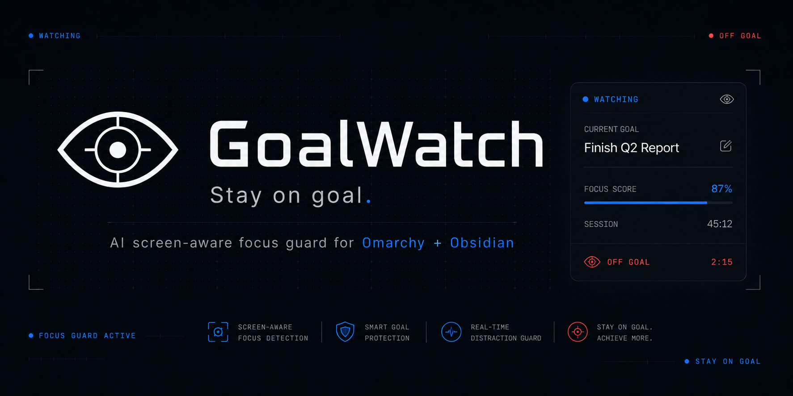
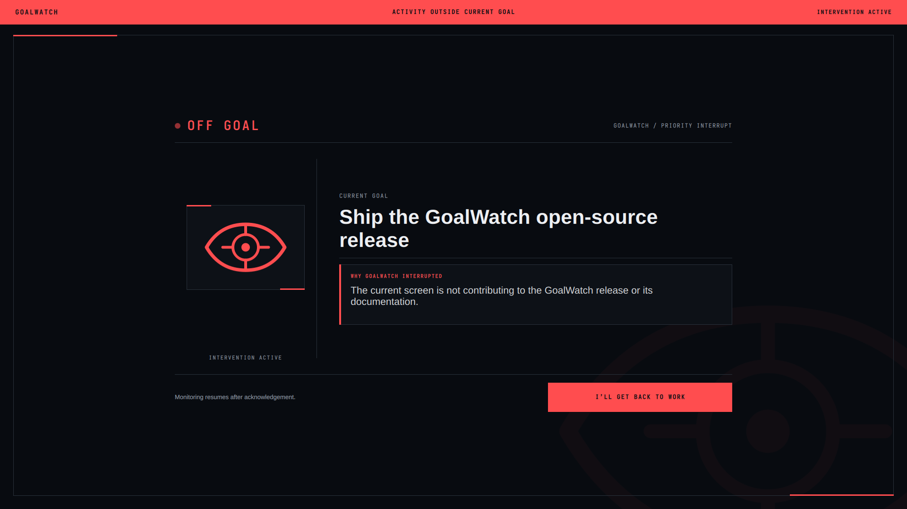

<p align="center">
  
</p>

<p align="center">
  <strong>A silent, screen-aware focus guard for Omarchy.</strong>
</p>

GoalWatch runs as a small systemd user service. At a configurable interval it
reads the goal entered in its Omarchy panel, captures the visible Wayland
desktop in memory, and asks Gemini whether the screen is useful to that goal.
On-goal and ambiguous activity stay silent. A clear deviation opens a blocking
intervention on every display. No goal means no capture and no Gemini request.

GoalWatch is Omarchy-first software, not a conventional desktop application.
Its controls and default goal workflow live in the Omarchy bar. Obsidian Sync
is an optional, one-tap integration.

## What ships

- A Python standard-library daemon with no virtual environment or Python package dependencies.
- A native Omarchy/Quickshell eye that toggles the service and exposes settings and status.
- A full-screen, keyboard-exclusive alert that cannot be dismissed by Escape or an outside click.
- Optional one-tap Obsidian Sync for Daily Notes, current-file selection, goal insertion, and `@goal` expansion.
- Exact Gemini structured output with conservative classification and fail-open error handling.
- Local, content-free metrics for focus score, checks, alerts, latency, usage, and return-to-goal time.
- User-local install, update, and uninstall scripts. Nothing under `/usr/share/omarchy` is modified.

## The intervention



The charcoal surface completely occludes the desktop. Alert red is limited to
the off-goal signal, diagnosis, and acknowledgement action. The eye uses the
same canonical geometry at bar, panel, and alert sizes.

## How it works

```text
Manual goal ────────────────┐
Optional Obsidian note ─────┴──────▶ GoalWatch CLI/config
                                           │
Omarchy eye ── start/stop/settings ─────────┤
                                           ▼
                                 systemd user service
                            Goal source  grim  Secret Service
                                  └──── prompt + JPEG ────▶ Gemini
                                                            │
                             Quickshell overlay ◀── runtime state
                             Local metrics      ◀── metadata only
```

Checks run on monotonic deadlines and never overlap. Screenshots are read from
`grim` through stdout, sent once, and discarded without being written to disk.
Invalid model output, network problems, missing setup, capture failures, and a
locked session never create an alert.

## Requirements

- Omarchy with its Quickshell bar and a Wayland session.
- A systemd user session.
- Obsidian desktop only if you want the optional companion workflow.
- A [Gemini API key](https://aistudio.google.com/api-keys).

The installer supplies missing Arch packages for Python, `grim`, and
`secret-tool` through Omarchy's package command.

## Install

Add the public repository through Omarchy, then run the included setup script:

```bash
omarchy plugin add https://github.com/JuanCamiloGrA/goalwatch.git --yes
~/.config/omarchy/plugins/com.goalwatch/install.sh
```

Omarchy deliberately clones third-party plugins disabled and never runs install
hooks. The second command is the explicit setup step for this hybrid plugin: it
installs missing system packages through Omarchy, copies the Python runtime,
adds the systemd user service, validates and enables the bar widget, and
preserves the Git checkout for future `omarchy plugin update` operations. It
does not install or modify Obsidian on a fresh install. An already-enabled
companion is updated in place. GoalWatch remains off after a first install.

If you are already working from a development checkout, run setup directly:

```bash
./install.sh
```

Useful installer options:

```bash
./install.sh --with-obsidian
./install.sh --vault /absolute/path/to/vault
./install.sh --skip-packages
```

`--with-obsidian` opts into the companion during setup. `--vault` implies it and
selects a specific vault when auto-detection is not appropriate.
`--skip-packages` turns missing dependencies into an error instead of installing
them.

## Update

For a marketplace checkout, review and pull the update with Omarchy, then
rerun setup so the background runtime and integrations match the new QML:

```bash
omarchy plugin update com.goalwatch
~/.config/omarchy/plugins/com.goalwatch/install.sh
```

For a development checkout, pull the repository and rerun `./install.sh`.

## First run

1. Open the gear beside the GoalWatch eye in the Omarchy bar.
2. Enter a Current Goal and edit Available Tools if needed. Both auto-save.
3. Enter a Gemini API key. The field replaces the stored key and never reveals it.
4. Click the gray eye.

The eye turns electric blue while the service is watching. No screenshot or
request is made until the first full interval has elapsed.

## Goal sources

Manual is the default and needs no note-taking application. Current Goal and
Available Tools are ordinary text fields in the panel. Changes restart the full
countdown, and an empty Current Goal suspends all captures and API calls.

Turn on **Obsidian Sync** to use the most recently active local vault. One tap:

- verifies that Obsidian and a local vault are available;
- installs and enables only the GoalWatch companion in that vault;
- switches the active source to Obsidian; and
- preserves the manual goal as an immediate fallback.

If Obsidian is missing, has never opened a vault, contains a stale vault entry,
or has an unsafe plugin registry, activation fails with an actionable message
and manual mode remains untouched. Turning the switch off is idempotent: it
immediately returns to manual mode and removes the companion without modifying
notes or other plugins. If Obsidian is already open and its CLI is disabled,
the panel asks for one restart so Obsidian can load or unload the companion.

### Obsidian goal format

```markdown
> Current Goal: Finish the GoalWatch release
>
> Available Tools: Codex, Browser, Obsidian and any tool useful to the goal.
```

The final valid block in the selected file wins. The tools sentence is editable
and is sent with the goal so relevant setup and research are not misclassified.

The Obsidian companion provides:

- **GoalWatch: Use today's daily note** — follows the configured Daily Notes folder and date format.
- **GoalWatch: Use current file** — uses the active Markdown file for the current date.
- **GoalWatch: Add goal** — inserts the canonical block at the cursor.
- `@goal` — expands to the same block while typing in a Markdown editor.

Manual file selection remains active for the current date. A new Daily Notes
path on the next date resumes automatic daily-note following.

## Settings

| Setting | Behavior |
|---|---|
| Interval | `5` minutes by default; accepts `1–1440` and restarts the countdown when changed. |
| Model | `gemini-flash-lite-latest` by default; applied on the next check. |
| API Key | Empty replacement field backed by Secret Service; double-click the label to open Google AI Studio. |
| Obsidian Sync | Optional one-tap companion install/removal; off by default. |
| Synced Markdown File | Daily path supplied by Obsidian or an absolute override, visible only while sync is on. |

Changes save automatically. Invalid values remain unsaved and visible in the
panel. Session durations and check countdowns update live while the panel is
open. When an alert is active, checks pause until **I’LL GET BACK TO WORK** is
pressed; acknowledgement starts a fresh countdown.

## Privacy and local data

Each enabled check sends the current goal, available-tools sentence, and one
compressed screenshot directly to Google's Gemini API. GoalWatch has no proxy,
account service, telemetry endpoint, or screenshot history.

- Screenshots stay in memory and are never saved by GoalWatch.
- The Gemini key is stored in the desktop Secret Service and never appears in config, argv, UI state, metrics, or logs.
- Metrics never retain goal text, screenshots, visible text, window titles, or Gemini explanations.
- Child-process and Gemini response streams have hard byte limits and deadlines; redirects are rejected before the API key can be replayed.
- Private config, runtime state, metrics, and Markdown reads use no-follow, descriptor-anchored I/O.
- Local metric rows are pruned after 90 days.
- Stopping GoalWatch cancels future captures and requests.

See [docs/PRIVACY.md](docs/PRIVACY.md) for the exact data boundary and
[docs/ARCHITECTURE.md](docs/ARCHITECTURE.md) for component ownership.

## CLI and diagnostics

```bash
goalwatch start                 # enable watching
goalwatch stop                  # disable watching
goalwatch toggle                # toggle the service
goalwatch status                # current runtime state as JSON
goalwatch metrics               # local aggregate metrics
goalwatch run-once              # one credentialed check now
goalwatch dismiss               # recovery path for an active alert
goalwatch doctor                # dependency and session diagnostics
goalwatch config show           # public configuration; never the key
goalwatch obsidian status       # optional integration state
goalwatch obsidian enable       # detect, install, enable, and select one vault
goalwatch obsidian disable      # switch to manual and remove the companion
```

Set or replace the key through stdin so it never enters the process arguments:

```bash
printf '%s\n' "$GEMINI_API_KEY" | goalwatch config set-api-key
```

The panel also sends manual goal edits through stdin. For scripting:

```bash
printf '%s\n' '{"goal":"Ship the release","tools":"Codex and Browser"}' \
  | goalwatch config set-manual-goal
```

Test the alert without taking a screenshot or spending API quota:

```bash
goalwatch debug alert --goal "Ship the release" \
  --complement "The current screen does not contribute to the release."
goalwatch debug clear
```

Service diagnostics:

```bash
systemctl --user status goalwatch.service
journalctl --user -u goalwatch.service -n 100
omarchy plugin validate ~/.config/omarchy/plugins/com.goalwatch
```

## Development

Run the complete offline verification suite:

```bash
./scripts/test.sh
```

It covers the Python core, Gemini schema and failure paths, scheduling,
configuration safety, local metrics, shell/JSON/QML checks, and the Obsidian
integration. The optional `./scripts/ai_benchmark.py` makes eight labelled live
Gemini requests using the locally stored key; it reports precision and false
alert rate without retaining responses.

Repository map:

```text
manifest.json, preview.png               Omarchy marketplace contract
src/goalwatch/                         daemon, CLI, capture, Gemini, state, metrics
integrations/omarchy/com.goalwatch/    Quickshell bar, panel, and alert
integrations/obsidian/goalwatch/       Obsidian desktop companion
packaging/                             CLI launcher and systemd user unit
scripts/                               installer support, tests, AI benchmark
tests/                                 offline tests and non-sensitive AI fixtures
docs/                                  architecture, privacy, measured verification
assets/                                canonical brand and UI previews
```

Before contributing, read [AGENTS.md](AGENTS.md). Its constraints apply equally
to human-written and AI-assisted changes. Measured acceptance results are in
[docs/VERIFICATION.md](docs/VERIFICATION.md).

## Uninstall

For a marketplace installation, run the bundled uninstaller rather than
`omarchy plugin remove` alone. Omarchy removes only the Git checkout and cannot
know about GoalWatch's user service or Obsidian integration.

```bash
~/.config/omarchy/plugins/com.goalwatch/uninstall.sh
```

This removes the runtime and both integrations while preserving config, key,
and metrics. From a development checkout, use `./uninstall.sh` instead. Remove
local data too with:

```bash
~/.config/omarchy/plugins/com.goalwatch/uninstall.sh --purge
```

Uninstalling never edits or deletes Markdown notes.

## License

[MIT](LICENSE) © 2026 Juan Camilo Grisales Arias.
